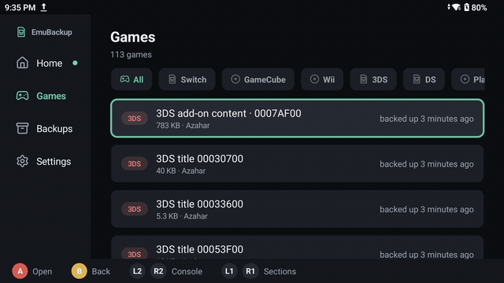
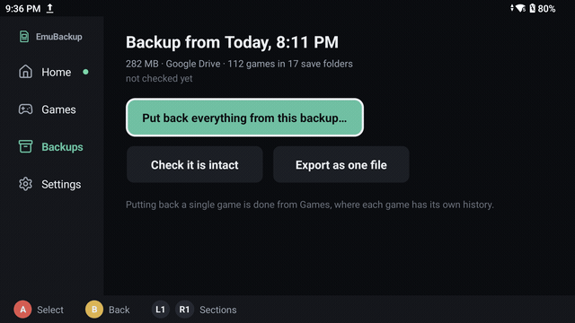
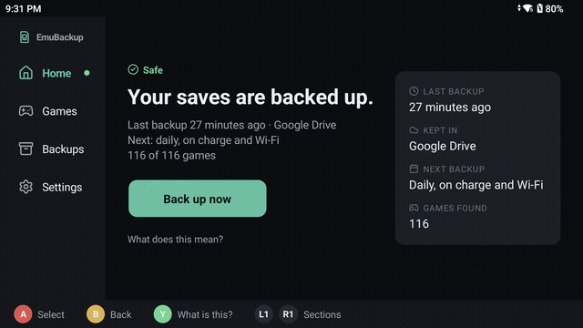
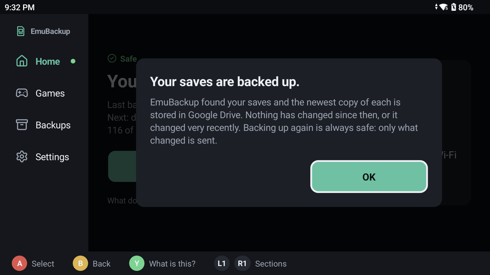
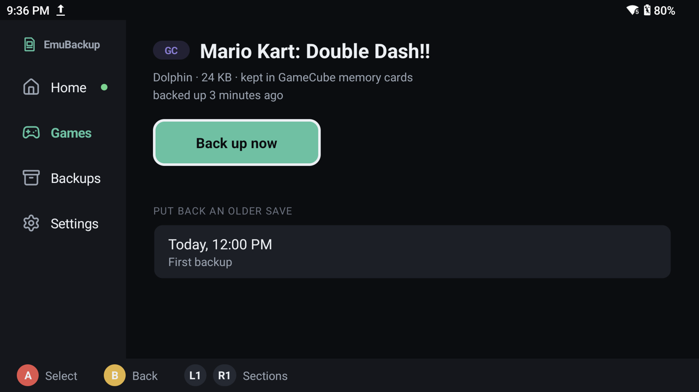
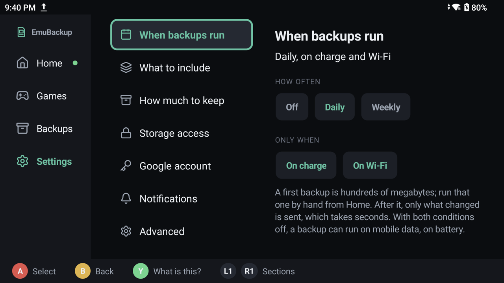
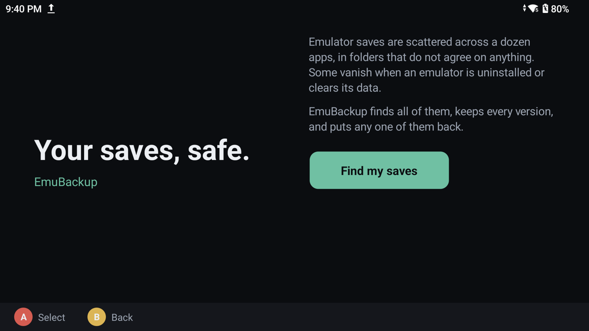

<p align="center">
  
</p>

# EmuBackup

[](https://github.com/tarikbc/emubackup/actions/workflows/build.yml)
[](https://github.com/tarikbc/emubackup/releases/latest)
[](https://github.com/tarikbc/emubackup/releases)
[](LICENSE)

**Emulator saves, backed up.** EmuBackup finds every emulator save on an Android device,
versions it, backs it up to Google Drive or a folder, and puts it back one game at a time.
It reaches the saves Android hides from ordinary apps, and it never reports a backup it has
not verified.

Save data on Android is scattered across a dozen emulator layouts. Some of it sits beside
multi-gigabyte ROMs in shared storage. Some of it sits in `Android/data`, where it is deleted
on uninstall and unreadable by other apps. On a typical handheld the saves worth keeping are a
few hundred megabytes out of a terabyte: small, scattered and irreplaceable.

EmuBackup is made for the handheld it runs on. Every screen works with a controller and by
touch, in landscape and in portrait. Home gives one plain answer, **your saves are backed up**
or what to do next, and the legend at the bottom names the buttons that act on the screen.

## Screenshots

Captured on an AYN Thor. Home, then the Games pane with the console filter driven by L2/R2:

<p align="center">
  
  
</p>

The Backups pane checking a stored backup is intact, and the panes walked with L1/R1:

<p align="center">
  
  
</p>

<p align="center">
  
  
</p>
<p align="center">
  
  
</p>

## What it does

- **Finds saves by an auditable registry**, not guesswork. One JSON file lists every path the
  app will ever touch, validated in CI. See [docs/TARGETS.md](docs/TARGETS.md).
- **Reads `Android/data` on stock, non-rooted devices.** Android 11 closed that directory to
  apps: `MANAGE_EXTERNAL_STORAGE` does not cover it and SAF cannot target it. With optional
  [Shizuku](https://shizuku.rikka.app/), EmuBackup reaches it anyway, which is where every
  GameCube, Wii, PS1 and legacy-Citra save lives. No root required.
- **Names games, not folders.** Titles come from the ROM headers (3DS, GameCube, Wii, DS,
  PSP) and profile names from the emulator's own files, so the list says *Mario Kart: Double
  Dash!!* rather than a hex id.
- **Backs up per game and per profile.** Put back one game for one profile, not everything.
- **Versioned and incremental.** Only changed files are sent, in seconds after the first run.
- **Google Drive, a folder you pick, or this device.** All three write the same tree.
- **Restores safely.** A dry-run preview, a snapshot of anything about to be overwritten, and
  saves that are newer on the device are skipped unless you say otherwise.
- **Never locks you in.** Plain zips, a readable manifest, and a `RESTORE.txt` with the exact
  commands to recover everything with nothing but `unzip`. See
  [docs/FORMAT.md](docs/FORMAT.md).
- **Never implies success it has not verified.** Files it could not read are named in the
  manifest and on screen, and a stored backup can be re-read and checksummed on demand.

## How it works

```
 targets.json  -->  scan  -->  one zip per save folder + manifest.json  -->  Google Drive
  (registry)      (shared +      (full, then incrementals that                a folder
                  Shizuku)        chain back to a full)                       this device
```

- The **registry** is a bundled JSON asset that names every emulator, path and glob. The
  tests read the shipped file and fail CI on a malformed glob, a duplicate id, or a sensitive
  target enabled by default. A power user can override it from a file on the SD card.
- A **version** is one manifest plus one archive per save folder. The first is a full; later
  ones hold only what changed and record which older versions they extract from, so pruning
  never deletes a base that a kept version still needs.
- **Check it is intact** reads every archive a version needs and compares every file's
  recorded SHA-256. On Drive that means downloading it; a check that does not read the bytes
  is not a check. **Export as one file** merges a version and its chain into one ordinary zip.

The whole design, with the reasons behind each decision, is in
[docs/ARCHITECTURE.md](docs/ARCHITECTURE.md).

## Install

Download `emubackup.apk` from the
[latest release](https://github.com/tarikbc/emubackup/releases/latest) and sideload it:

```sh
adb install -r emubackup.apk
```

Android warns about installing from an unknown source. That is expected: the app needs
all-files access, which keeps it off the Play Store.

> **All-files access** is requested because emulator save folders are owned by other apps at
> arbitrary paths, which scoped storage cannot reach.
>
> **Shizuku is optional, and it has a ceiling.** Without it you still get every save in shared
> storage. With it you also get Dolphin, legacy Citra, Vita3K, aPS3e, GTA SA and Clone Hero.
> You do not get DuckStation, which writes its cards mode `600`, or Minecraft worlds under
> Amethyst, which are group-owned by the app; Shizuku grants the `shell` identity, not root.
> EmuBackup names those files instead of skipping them silently, and Home offers to set the
> folder aside once you have seen it. Measured counts are in
> [docs/PROVENANCE.md](docs/PROVENANCE.md).

## First run

A new install opens a short walkthrough: what the app does, the one permission it needs,
what it found in your saves, where to keep the backup, and Shizuku only if something is
locked. It can be left at any point and reopened from Settings.

On the device it was built for, the Backups pane reads:

```
282 MB · Google Drive · 112 games in 17 save folders
18 archives checked, 125 MB read. Every one matches.
```

## Where backups go

- **Google Drive.** Survives losing the device. Needs your own OAuth client, pasted into the
  app once; see [docs/DRIVE_SETUP.md](docs/DRIVE_SETUP.md). The scope is `drive.file`, so
  the app can only see files it created.
- **A folder you pick.** An SD card, a USB drive, or a folder a sync app such as Nextcloud
  owns, in which case the backup leaves the device with no account involved.
- **This device.** Internal storage. It survives an emulator wiping its own data, which is
  the common way saves are lost, and nothing else.

Switching between them loses nothing: a version written to one restores exactly like a
version written to another.

## Automatic backups

Daily or weekly, through `JobScheduler`, persisted across reboots, by default only on charge
and on Wi-Fi. A job has a bounded runtime, so the first backup of several hundred megabytes
is run by hand from Home; every later run is an incremental measured in seconds.

Three failed scheduled runs in a row turn the schedule off and raise a notification, because a
job retrying quietly forever is worse than no backup. Every run, manual or scheduled, is in
the run history under Settings, shareable as plain text.

## Keeping backups honest

**What is included.** Game saves, always. Save states and emulator keys are off by default:
states are large, tied to one emulator build and recreated by playing, and keys are not
save data. Settings shows what each would cost on your device before you switch it on.

**What is deleted.** Retention keeps the newest N versions, 20 by default. Three things are
never removed: the newest version, the snapshots taken before a restore, and any version a
kept version's chain extracts from.

**What is reported.** A run that could not read a file says so, by name, on the finished
screen and in the manifest. Restoring into app-private storage asks for confirmation, because
it is the most invasive thing the app does.

## Build from source

Built without Gradle or Android Studio, from three shell scripts on the plain SDK:

```sh
git clone https://github.com/tarikbc/emubackup && cd emubackup
./vendor-libs.sh    # curl the AARs it needs straight from Maven
./test.sh           # javac the android-free classes, run JUnit 5 on a plain JVM
./build.sh          # aapt2 -> javac -> d8 -> zipalign -> apksigner
adb install -r build/emubackup.apk
```

Requires JDK 17, the Android SDK with platform 34 and build-tools 35.0.0, and `ANDROID_HOME`
set. Plain Java 17, Views built in code, no dependency injection, no coroutines, no Compose.
71 of the 122 classes have no `android.*` imports, the backup and restore engines among
them, so the logic that can lose data is tested end to end on a JVM. `test.sh` enforces that
property rather than trusting it.

Release APKs carry no Google credentials, by a rule in the workflow rather than by
convention. A published APK cannot keep an OAuth secret, and one shared client would put
every user on one project. Google Drive therefore needs your own client, pasted into the
app; no rebuild is involved.

## Documentation

| File | What it covers |
| --- | --- |
| [docs/ARCHITECTURE.md](docs/ARCHITECTURE.md) | The design and the reasons: registry, engines, storage, Shizuku, screens |
| [docs/DESIGN.md](docs/DESIGN.md) | The design system: identity, colour, type, layout, components, states, language |
| [docs/INPUT.md](docs/INPUT.md) | The controller model, focus rules, and how to verify them over adb |
| [docs/FORMAT.md](docs/FORMAT.md) | The on-disk backup format and how to restore by hand |
| [docs/TARGETS.md](docs/TARGETS.md) | The save-location registry and its rules |
| [docs/PROVENANCE.md](docs/PROVENANCE.md) | Every path, measured on a real device |
| [docs/DRIVE_SETUP.md](docs/DRIVE_SETUP.md) | Creating your own Google OAuth client |
| [docs/THIRD_PARTY.md](docs/THIRD_PARTY.md) | Vendored libraries and their licenses |

## Layout

```
src/main/java/com/tarikbc/emubackup/   one flat package: engines, panes, shell, helpers
src/main/assets/targets.json           the save-location registry
src/main/res/                          vector icons (Lucide), colours, the launcher icon
test/java/                             JUnit 5 tests for the android-free classes
tools/vendor-icons.py                  SVG -> VectorDrawable, no dependencies
docs/                                  ARCHITECTURE, DESIGN, INPUT, FORMAT, TARGETS, ...
build.sh  test.sh  vendor-libs.sh      the whole toolchain
.github/workflows/build.yml            build on push; sign and release on a v* tag
```

## Credits

[Shizuku](https://github.com/RikkaApps/Shizuku) by RikkaApps for privileged access without
root. Icons from [Lucide](https://lucide.dev/) (ISC). The emulator authors whose save layouts
this maps.

Not affiliated with any emulator project or with Google. Bring your own games.

## License

[Apache-2.0](LICENSE).

[Privacy policy](PRIVACY.md) and [terms](TERMS.md). Short version: there is no server, no
account and no analytics. Backups go from your device straight to your own Drive, under a
scope that can only see files the app itself created.
